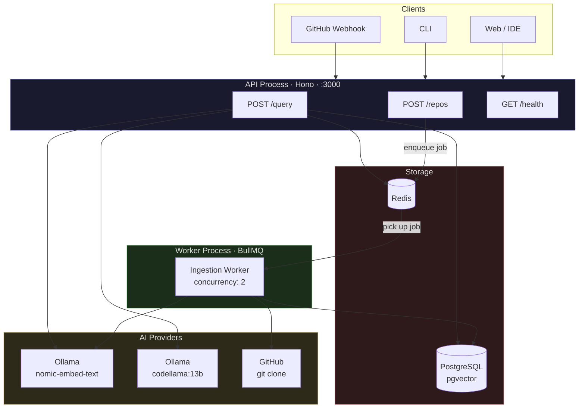
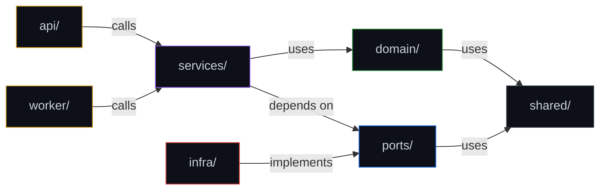
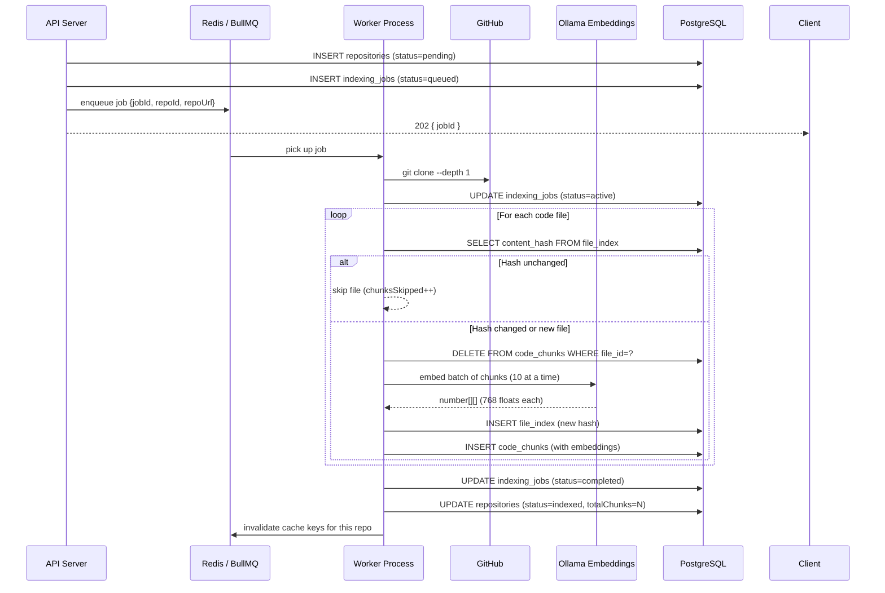
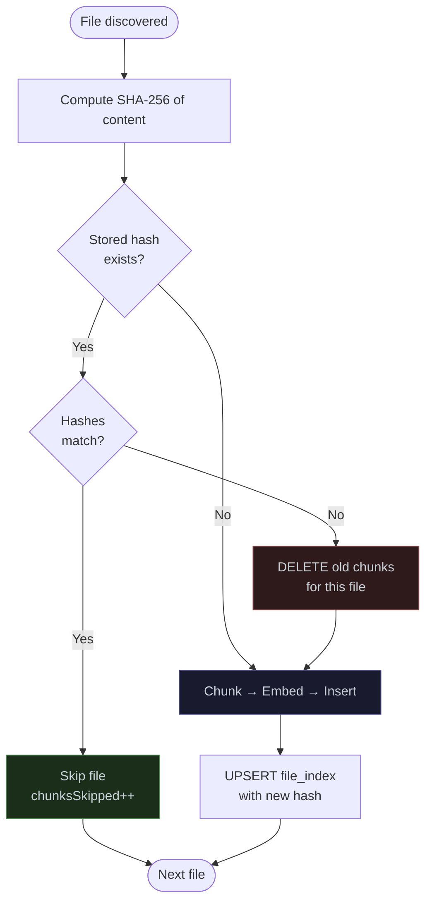
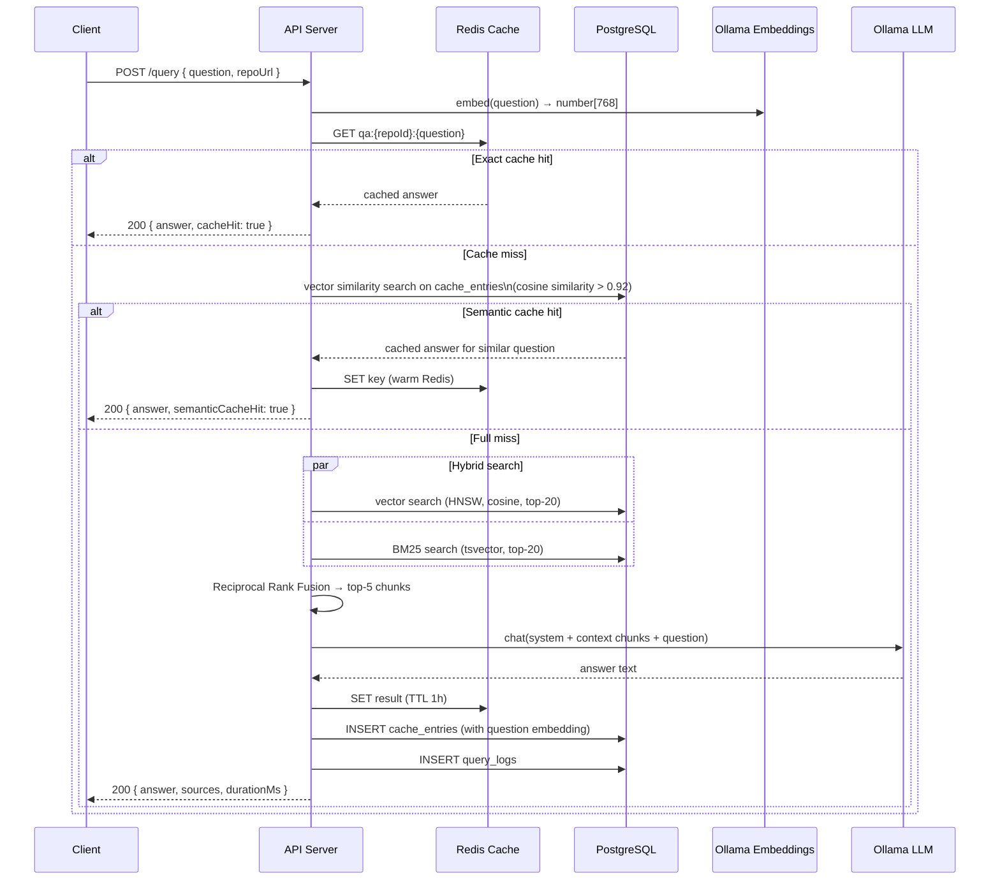
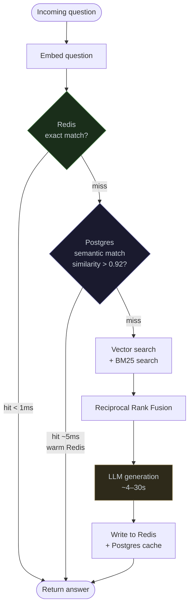
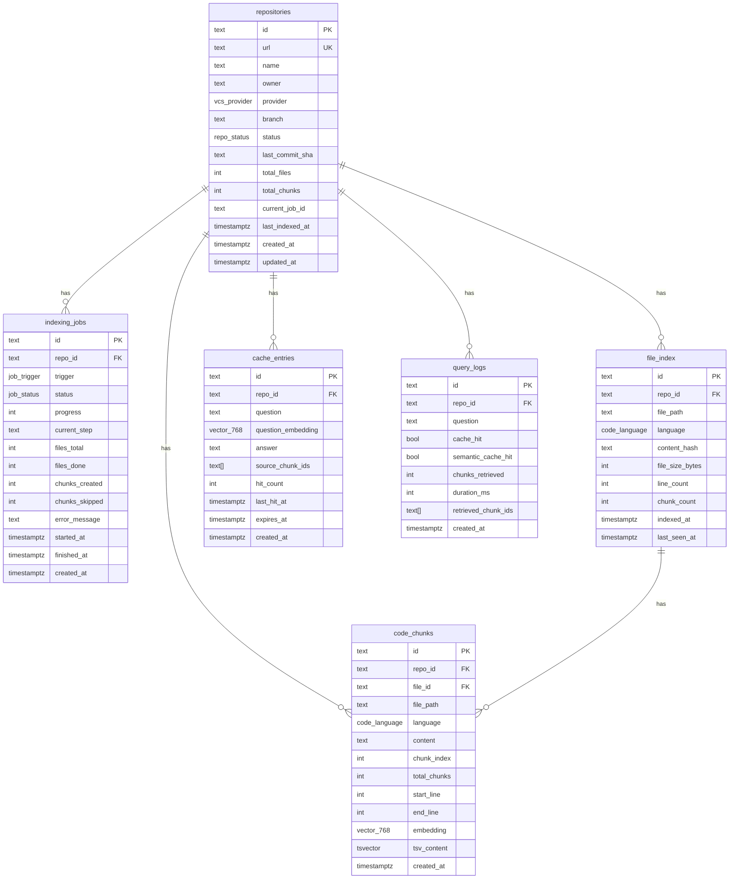

# codebase-qa

Ask natural language questions about any GitHub repository. Get answers grounded in the actual code.

```bash
curl -X POST https://api.your-domain.com/query \
  -H "Content-Type: application/json" \
  -d '{"question": "How does authentication work?", "repoUrl": "https://github.com/org/repo"}'
```

```json
{
  "answer": "Authentication is handled in src/middleware/auth.ts. The verifyJWT() function on line 12 validates the Bearer token from the Authorization header...",
  "sources": [
    { "filePath": "src/middleware/auth.ts", "startLine": 12, "rrfScore": 0.032 },
    { "filePath": "src/api/routes/user.routes.ts", "startLine": 44, "rrfScore": 0.028 }
  ],
  "cacheHit": false,
  "durationMs": 4821
}
```

---

## Stack

| Layer | Technology |
|---|---|
| Runtime | [Bun](https://bun.sh) |
| API framework | [Hono](https://hono.dev) |
| Database | PostgreSQL 16 + [pgvector](https://github.com/pgvector/pgvector) |
| ORM | [Drizzle ORM](https://orm.drizzle.team) |
| Job queue | [BullMQ](https://docs.bullmq.io) + Redis |
| Fast cache | Redis (ioredis) |
| Durable cache | PostgreSQL (semantic similarity via pgvector) |
| Embeddings | Ollama (`nomic-embed-text`) — swappable via `IEmbeddingProvider` |
| LLM | Ollama (`codellama:13b`) — swappable via `ILLMProvider` |
| Vector search | pgvector HNSW index, cosine similarity |
| Keyword search | PostgreSQL `tsvector` / BM25 |
| Search merge | Reciprocal Rank Fusion |

---

## Architecture

The system runs as two independent processes sharing a database and a Redis instance.



### Dependency rule

Dependencies only point inward. Infrastructure knows about domain — domain never knows about infrastructure.



Swapping Ollama for OpenAI, or Postgres for another database, requires changes only in `infra/` — services and domain are untouched.

---

## Ingestion pipeline

Triggered by `POST /repos`, `POST /webhooks/github`, or a cron schedule. The API returns `202 Accepted` immediately. The worker process handles the rest asynchronously.



### Incremental indexing

Every file is SHA-256 hashed before embedding. On re-index, files whose hash matches the stored value are skipped entirely — no embedding calls made.



| Run | Behaviour |
|---|---|
| First index (200 files) | All 200 files embedded |
| Re-index, nothing changed | 0 files embedded (all skipped) |
| Re-index, 10 files changed | 10 files embedded, 190 skipped |

---

## Query pipeline



### Cache layers



**Redis** — exact key match, sub-millisecond, volatile (lost on flush).
**Postgres `cache_entries`** — semantic similarity via HNSW on question embeddings. Survives Redis restarts. Used to warm Redis on cold start.

---

## Database schema



---

## Project structure

```
codebase-qa/
├── src/
│   ├── shared/
│   │   ├── types.ts          # Branded types, Result<T>, AppError
│   │   └── config.ts         # Validated env vars — fails fast at startup
│   │
│   ├── domain/               # Business entities — no infra imports
│   │   ├── repo.ts           # Repository entity, parseRepoUrl()
│   │   ├── chunk.ts          # CodeChunk entity, hashContent(), detectLanguage()
│   │   └── job.ts            # IndexingJob entity
│   │
│   ├── ports/
│   │   └── index.ts          # IRepoStore, IChunkStore, IJobStore,
│   │                         # IEmbeddingProvider, ILLMProvider,
│   │                         # IKVCache, IIngestionQueue, IQueryLogger
│   │
│   ├── infra/
│   │   ├── db/
│   │   │   ├── client.ts     # Postgres connection pool + Drizzle instance
│   │   │   ├── repo.repo.ts  # IRepoStore → Postgres
│   │   │   ├── chunk.repo.ts # IChunkStore + IFileStore → Postgres + pgvector
│   │   │   ├── job.repo.ts   # IJobStore → Postgres
│   │   │   └── query-logger.ts # IQueryLogger → Postgres
│   │   ├── cache/
│   │   │   ├── redis.client.ts    # IKVCache → Redis
│   │   │   ├── pg-cache.store.ts  # ICacheEntryStore → Postgres
│   │   │   └── two-layer.cache.ts # Redis + Postgres combined strategy
│   │   ├── ollama/
│   │   │   ├── embedding.ts  # IEmbeddingProvider → Ollama HTTP
│   │   │   └── llm.ts        # ILLMProvider → Ollama HTTP (stream + non-stream)
│   │   └── queue/
│   │       └── bullmq.queue.ts # IIngestionQueue → BullMQ + Redis
│   │
│   ├── services/
│   │   ├── chunker.service.ts  # Fixed / recursive / sliding-window strategies
│   │   ├── ingest.service.ts   # scheduleIndexing() + executeIndexing()
│   │   └── query.service.ts    # query() with hybrid search + RRF + cache
│   │
│   ├── api/
│   │   ├── server.ts           # Composition root — wires all dependencies
│   │   └── routes/
│   │       ├── repo.routes.ts  # POST /repos, GET /repos, GET /repos/:id/jobs/:jobId
│   │       └── query.routes.ts # POST /query
│   │
│   └── worker/
│       └── worker.ts           # BullMQ worker — runs as separate process
│
├── drizzle/
│   └── schema.ts               # All table definitions + Postgres enums
│
├── scripts/
│   ├── index-repo.ts           # CLI: index a repo manually
│   ├── test-embeddings.ts      # Verify Ollama is returning valid vectors
│   └── test-query.ts           # Run a query end-to-end from the CLI
│
├── docker-compose.yml          # Postgres 16 + pgvector, Redis 7
├── drizzle.config.ts
├── .env.example
├── package.json
└── tsconfig.json
```

---

## API reference

### `POST /repos`

Register a repository and schedule it for indexing.

**Request**
```json
{
  "url":     "https://github.com/org/repo",
  "branch":  "main",
  "trigger": "manual"
}
```

**Response** `202 Accepted`
```json
{
  "jobId":  "550e8400-e29b-41d4-a716-446655440000",
  "repoId": "6ba7b810-9dad-11d1-80b4-00c04fd430c8",
  "status": "queued"
}
```

If the repository is already being indexed, returns `202` with `"status": "already_queued"` and the existing `jobId`.

---

### `GET /repos`

List all registered repositories.

**Response** `200 OK`
```json
{
  "repos": [
    {
      "id":           "6ba7b810-...",
      "url":          "https://github.com/org/repo",
      "name":         "repo",
      "owner":        "org",
      "status":       "indexed",
      "totalFiles":   87,
      "totalChunks":  312,
      "lastIndexedAt":"2024-01-15T10:30:00Z"
    }
  ]
}
```

---

### `GET /repos/:id/jobs/:jobId`

Poll indexing job progress.

**Response** `200 OK`
```json
{
  "id":            "550e8400-...",
  "status":        "active",
  "progress":      45,
  "currentStep":   "Embedding files (39/87)",
  "filesTotal":    87,
  "filesDone":     39,
  "chunksCreated": 156,
  "chunksSkipped": 12,
  "startedAt":     "2024-01-15T10:29:50Z"
}
```

`status` values: `queued` → `active` → `completed` | `failed`

---

### `POST /query`

Ask a natural language question about an indexed repository.

**Request**
```json
{
  "question": "How does the authentication middleware work?",
  "repoUrl":  "https://github.com/org/repo",
  "topK":     5
}
```

**Response** `200 OK`
```json
{
  "answer": "The authentication middleware is defined in src/middleware/auth.ts...",
  "sources": [
    {
      "filePath":  "src/middleware/auth.ts",
      "startLine": 12,
      "content":   "export async function authMiddleware(c: Context, next: Next) {",
      "rrfScore":  0.0328
    }
  ],
  "cacheHit":         false,
  "semanticCacheHit": false,
  "durationMs":       4821
}
```

---

### `GET /health`

```json
{ "status": "ok", "ts": "2024-01-15T10:30:00Z" }
```

Returns `503` if Postgres or Redis is unreachable.

---

## Local development

### Prerequisites

- [Bun](https://bun.sh) ≥ 1.0
- [Docker Desktop](https://www.docker.com/products/docker-desktop)
- [Ollama](https://ollama.com) ≥ 0.3 (install steps below)

---

### 1. Install Ollama

**macOS**
```bash
brew install ollama
```
Or download the `.dmg` from [ollama.com/download](https://ollama.com/download/mac).

**Linux**
```bash
curl -fsSL https://ollama.com/install.sh | sh
```

**Windows**

Download the installer from [ollama.com/download](https://ollama.com/download/windows).

Verify the installation:
```bash
ollama --version
# ollama version 0.x.x
```

---

### 2. Pull the required models

This project uses two models — one for embeddings, one for answer generation.

```bash
# Start the Ollama server (keep this running in a terminal)
ollama serve

# In a new terminal, pull both models
ollama pull nomic-embed-text   # ~274 MB  — embedding model
ollama pull codellama:13b      # ~7.4 GB  — code-focused LLM
```

Verify both are available:
```bash
ollama list
# NAME                    ID              SIZE    MODIFIED
# codellama:13b           ...             7.4 GB  ...
# nomic-embed-text:latest ...             274 MB  ...
```

Verify embeddings work:
```bash
curl http://localhost:11434/api/embeddings \
  -d '{"model":"nomic-embed-text","prompt":"hello world"}'
# {"embedding":[0.034,...]}  ← array of 768 floats
```

Verify the LLM responds:
```bash
ollama run codellama:13b "What is a REST API? Answer in one sentence."
# A REST API is a set of rules...
```

#### Model selection guide

| Model | Size | RAM needed | Best for |
|---|---|---|---|
| `nomic-embed-text` | 274 MB | ~500 MB | Embeddings — always use this |
| `codellama:7b` | 3.8 GB | ~6 GB | Fast answers, lower quality |
| `codellama:13b` ✅ | 7.4 GB | ~10 GB | Good quality/speed balance — **recommended** |
| `deepseek-coder:6.7b` | 3.8 GB | ~6 GB | Alternative — excellent for code |
| `codellama:34b` | 19 GB | ~24 GB | Best quality, needs 32 GB RAM |

> **Apple Silicon (M1/M2/M3):** Ollama uses the GPU via Metal. `codellama:13b` runs
> comfortably on 16 GB unified memory. `codellama:34b` needs 32 GB.
>
> **Linux / Windows with NVIDIA GPU:** Ollama uses CUDA automatically if a GPU is
> detected. Any model that fits in VRAM runs on GPU; the rest spills to CPU RAM.
>
> **No GPU:** All models run on CPU. Expect `codellama:13b` to take 30–90s per
> answer instead of 3–10s. Use `codellama:7b` or `deepseek-coder:6.7b` for better speed.

To use a different LLM, update your `.env`:
```bash
OLLAMA_LLM_MODEL=deepseek-coder:6.7b
```
No code changes required — the model name is injected via `ILLMProvider`.

---

### 3. Project setup

```bash
# Clone and install dependencies
git clone https://github.com/your-org/codebase-qa
cd codebase-qa
bun install

# Copy and configure env vars
cp .env.example .env

# Start Postgres + Redis
docker compose up -d

# Push database schema
bun db:push

# Run the manual SQL setup (tsvector trigger + BM25 index)
docker exec -i rag_postgres psql -U dev -d codebase_qa < scripts/setup.sql
```

### 4. Run

```bash
# Terminal 1 — API server
bun run dev

# Terminal 2 — Worker (must run separately)
bun run worker
```

### 5. Index a repository

```bash
# Via CLI
bun run index https://github.com/honojs/hono

# Via API
curl -X POST http://localhost:3000/repos \
  -H "Content-Type: application/json" \
  -d '{"url":"https://github.com/honojs/hono"}'
```

### 6. Query

```bash
curl -X POST http://localhost:3000/query \
  -H "Content-Type: application/json" \
  -d '{"question":"How does routing work?","repoUrl":"https://github.com/honojs/hono"}'
```

---

## Environment variables

| Variable | Required | Default | Description |
|---|---|---|---|
| `DATABASE_URL` | ✅ | — | Postgres connection string |
| `REDIS_URL` | ✅ | — | Redis connection string |
| `OLLAMA_BASE_URL` | | `http://localhost:11434` | Ollama server URL |
| `OLLAMA_EMBED_MODEL` | | `nomic-embed-text` | Embedding model |
| `OLLAMA_LLM_MODEL` | | `codellama:13b` | Generation model |
| `OLLAMA_EMBED_DIMS` | | `768` | Embedding dimensions |
| `OLLAMA_NUM_CTX` | | `4096` | LLM context window |
| `MAX_FILE_SIZE_BYTES` | | `100000` | Skip files larger than this |
| `MAX_CHUNK_SIZE` | | `800` | Max chars per chunk |
| `EMBED_BATCH_SIZE` | | `10` | Parallel embedding calls |
| `CLONE_DIR` | | `/tmp/rag-repos` | Temporary clone directory |
| `WORKER_CONCURRENCY` | | `2` | Parallel indexing jobs |
| `CACHE_TTL_SEC` | | `3600` | Redis cache TTL |
| `SEMANTIC_CACHE_TTL_SEC` | | `3600` | Postgres cache TTL |
| `JOB_ATTEMPTS` | | `3` | BullMQ retry attempts |
| `JOB_BACKOFF_MS` | | `5000` | Initial backoff delay |
| `PORT` | | `3000` | API server port |

---

## Replacing AI providers

Both the embedding model and LLM are behind interfaces (`IEmbeddingProvider`, `ILLMProvider`). Switching to OpenAI requires a new adapter in `src/infra/` — services are unchanged.

```typescript
// src/infra/openai/embedding.ts
export class OpenAIEmbedder implements IEmbeddingProvider {
  readonly model      = 'text-embedding-3-small'
  readonly dimensions = 1536

  async embed(text: string): Promise<Result<number[]>> {
    // ...
  }
}
```

Then swap in `src/api/server.ts`:
```typescript
// Before
const embedder = new OllamaEmbedder()

// After
const embedder = new OpenAIEmbedder(process.env.OPENAI_API_KEY!)
```

> **Note:** switching embedding models requires re-indexing all repositories. Old and new embeddings live in different vector spaces and are not comparable.

---

## License

MIT